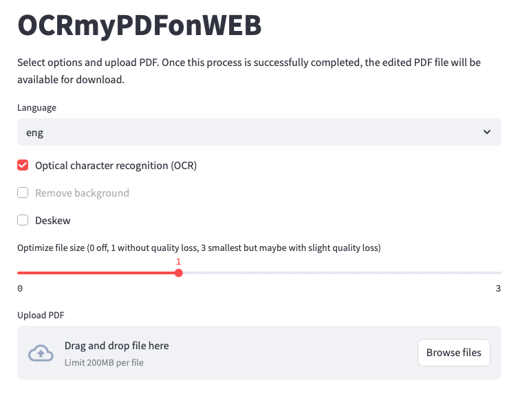

# OCRmyPDFonWEB

Streamlit Web UI for OCRmyPDF. Its codebase is tiny, so if you want to modify it, it should be straightforward. It is also stateless, making it easy to deploy. No volumes. No configuration.



## Requirements

* docker

## Usage

```
git clone https://github.com/heapsoftware/OCRmyPDFonWEB.git
docker build -t heapsoftware/ocmypdfonweb OCRmyPDFonWEB

docker run --rm -p 192.168.4.39:8501:8501 heapsoftware/ocmypdfonweb
Or:
docker run -d --rm -p 192.168.4.39:8501:8501 heapsoftware/ocmypdfonweb
```

Open http://localhost:8501

## Develop

```
docker build -t heapsoftware/ocrmypdfonweb:dev . # Only needed after you changed requirements.txt
docker run --rm -it -p 127.0.0.1:8501:8501 -v ${PWD}/server.py:/app/server.py razemio/ocrmypdfonweb:dev
```

Happy coding :)

## FAQ

### Why?

To keep your non-tech significant other happy. The terminal can be a dark place for some people.

### What version of OCRmyPDF version are you using?
Latest version with latest version of tesseract based on the OCRmyPDF ubuntu docker image
